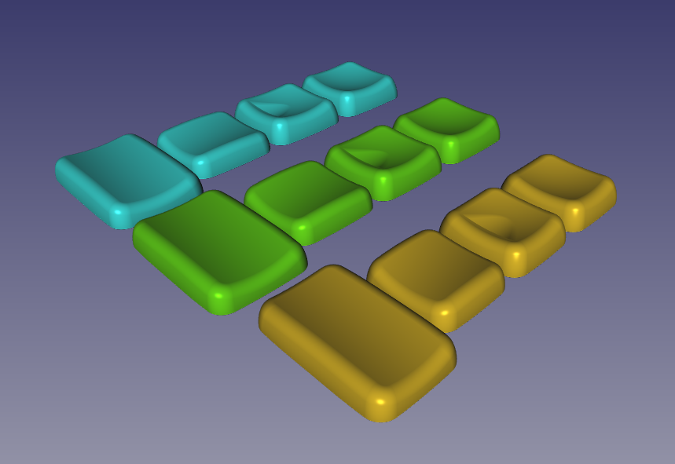
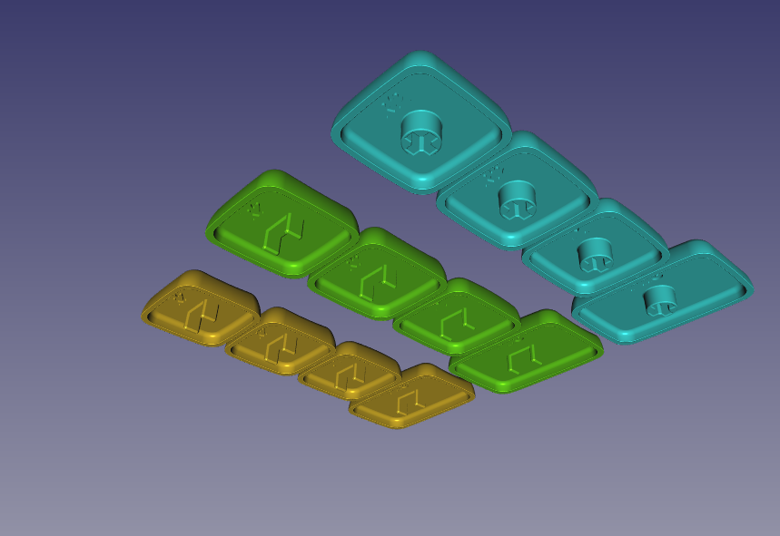
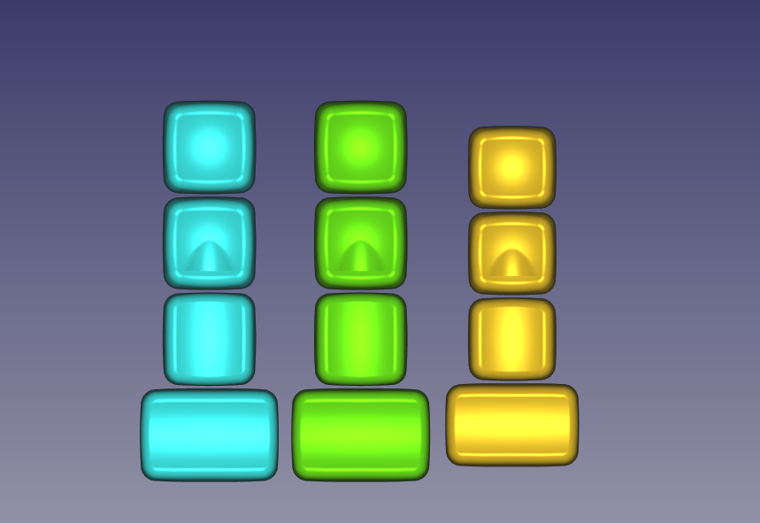

# HedgeHog keycaps

Support choc or mx stem and exported in three variants - mx spacing mx stem (mx-mx), mx spacing choc stem (mx-choc), choc spacing choc stem (choc-choc). Set consist of 3 types of 1u caps and 1 type of 1.5u caps.

1u types:
 * R2 - main keycap profile;
 * R2-home - homing keys with aggressive homings;
 * T1 - keycap for thumb cluster;

1.5u keycaps:
 * T1.5 - 1.5u version of 1u thumb keycap;

