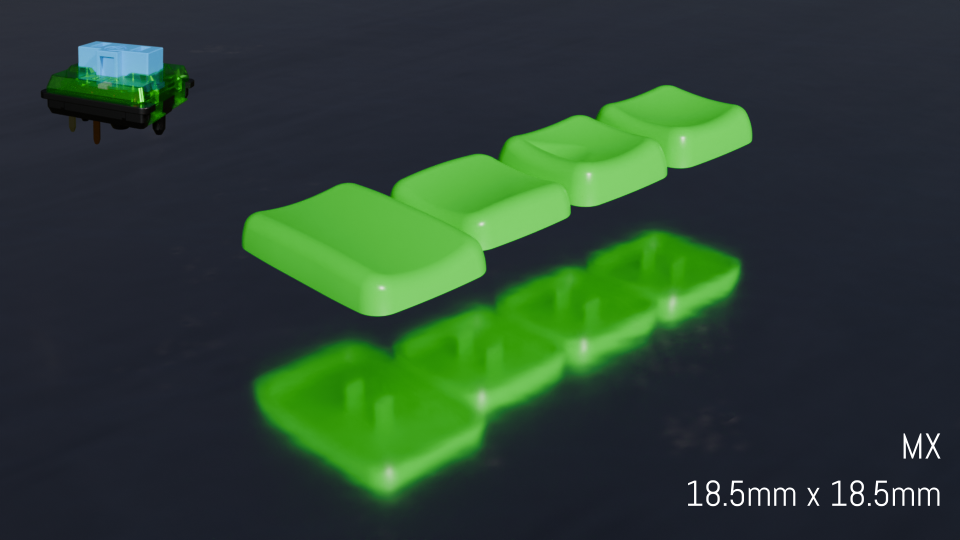
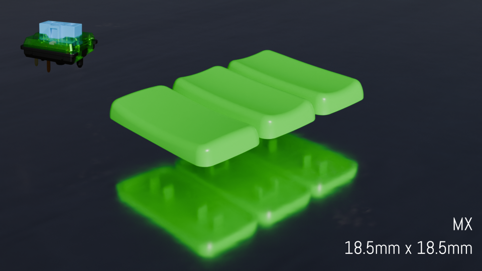

# HedgeHog keycaps

Support choc or mx stem and exported in four variants - choc spacing choc stem (choc-choc), choc spacing mx stem (choc-mx), mx spacing choc stem (mx-choc), mx spacing mx stem (mx-mx). Basic set consist of 3 types of 1u caps and 1 type of 1.5u caps. POS set consist of horizontal and vertical generic 2u caps and horizontal thumb 2u cap.

Basic type keycaps:
 * R2 - main keycap profile;
 * R2-home - homing keys with aggressive homings;
 * T1 - keycap for thumb cluster;
 * 1.5T1-H - 1.5u version of 1u thumb keycap, horizontal orientation;

POS mount style keycaps:
 * 2R2-H - 2u horizontal;
 * 2R2-V - 2u vertical;
 * 2T1-H - 2u horizontal thumb;

# Rendered models

## Basic set

### Choc spacing, Choc stem (choc-choc)

### Choc spacing, MX stem (choc-mx)

### MX spacing, Choc stem (mx-choc)

### MX spacing, MX stem (mx-mx)

## POS set

### Choc spacing, Choc stem (choc-choc)

### Choc spacing, MX stem (choc-mx)

### MX spacing, Choc stem (mx-choc)

### MX spacing, MX stem (mx-mx)

# Realworld applications

## PNCATEHO

## Corne

# Printing guide

You can print as you think it will be better, but I personally prefer print it at 45 degree and 0.1 mm layer height. Also 75 degrees give good results. Placing bottom side to table allow you to acheive good surface, placing up uside to table could eliminate usage of supports.

## Bottom side to table 45 degree

## Bottom side to table 75 degree

## Up side face to table 45 degree (135 degree)

## Up side face to table 75 degree (105 degree)

