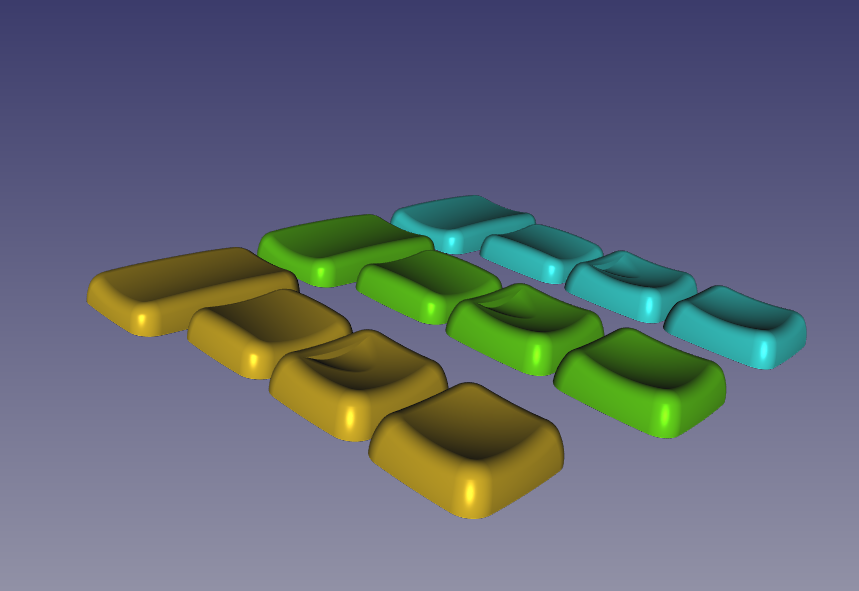

# HedgeHog keycaps

Support choc or mx stem and exported in three variants - mx spacing mx stem (mx-mx), mx spacing choc stem (mx-choc), choc spacing choc stem (choc-choc). Set consist of 3 types of 1u caps and 1 type of 1.5u caps.

1u types:
 * R2 - main keycap profile;
 * R2-home - homing keys with aggressive homings;
 * T1 - keycap for thumb cluster;

1.5u keycaps:
 * T1.5 - 1.5u version of 1u thumb keycap;

# Rendered models

# Realworld applications

## PNCATEHO

## Corne

# Printing guide

You can print as you think it will be better, but I personally prefer print it at 45 degree and 0.1 mm layer height. Also 75 degrees give good results. Placing bottom side to table allow you to acheive good surface, placing up uside to table could eliminate usage of supports.

## Bottom side to table 45 degree

## Bottom side to table 75 degree

## Up side face to table 45 degree (135 degree)

## Up side face to table 75 degree (105 degree)

